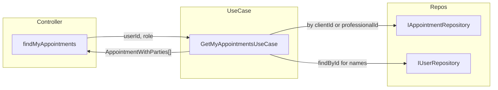

# Plan: findMyAppointments para profesional + DTO con nombres

## Problema actual

- **Controller** (`[appointment.controller.ts](src/interfaces/http/controllers/appointment.controller.ts)`) siempre pasa `req.user.userId` como `clientId` al use case (líneas 135–136).
- **GetMyAppointmentsUseCase** (`[get-my-appointments.use-case.ts](src/application/use-cases/get-my-appointments.use-case.ts)`) solo llama a `findByClientId(clientId)`, por lo que cuando el usuario es **profesional** no hay citas donde él sea el cliente y la respuesta es `{"success":true,"data":[]}`.
- **AppointmentResponseDto** (`[appointment.mapper.ts](src/interfaces/http/mappers/appointment.mapper.ts)`) solo expone `professionalId` y `clientId`; el front no puede mostrar nombres sin llamadas extra.

## Enfoque (Clean Architecture + SOLID + KISS)

1. **Un solo use case** “mis citas”: según el **rol** del usuario (JWT: `req.user.role`), decidir si se buscan citas por `clientId` o por `professionalId`. El repositorio ya expone `findByProfessionalId` y `findByClientId`.
2. **Enriquecimiento en Application**: el use case, además del repositorio de citas, usará `IUserRepository` para cargar profesional y cliente de cada cita y devolver un tipo “appointment + datos de profesional y cliente” (firstName, lastName).
3. **DTO HTTP**: extender `AppointmentResponseDto` con `professional` y `client` (firstName, lastName) y mapear solo en la capa de interfaces.

---

## 1. Capa Application: resultado enriquecido y use case

**Definir tipo de resultado (application):**

- Crear un tipo/interface en la capa application para el resultado de “mis citas enriquecidas”, por ejemplo en el mismo archivo del use case o en `src/application/dtos/` (si se prefiere centralizar DTOs de aplicación).
- Contenido: por cada cita, el `Appointment` más `professional: { firstName, lastName }` y `client: { firstName, lastName }` (sin exponer dominio User en interfaces; solo los campos necesarios).

**Modificar `[get-my-appointments.use-case.ts](src/application/use-cases/get-my-appointments.use-case.ts)`:**

- **Entrada:** en lugar de `execute(clientId: string)`, usar `execute(userId: string, role: string)`.
- **Normalización de rol:** comparar con `Role.PROFESSIONAL` (enum en `[role.enum.ts](src/domain/enums/role.enum.ts)`). Por si el JWT envía minúsculas, usar `role?.toUpperCase() === Role.PROFESSIONAL`.
- **Lógica:**
  - Si rol es profesional: `appointmentRepository.findByProfessionalId(userId)`.
  - Si no: `appointmentRepository.findByClientId(userId)`.
- **Enriquecimiento:**
  - Inyectar `IUserRepository` (ya existe y está registrado en `[user.providers.ts](src/interfaces/providers/user.providers.ts)`).
  - Para cada cita, obtener `User` del profesional y del cliente con `userRepository.findById(professionalId)` y `userRepository.findById(clientId)`.
  - Para evitar N+1: recorrer las citas, reunir `professionalId` y `clientId` únicos, hacer un `findById` por cada id distinto y guardar en un `Map<string, User>` (o dos mapas), luego construir el array de resultados enriquecidos.
  - Si `findById` devuelve `null` (usuario eliminado), usar un fallback razonable (ej. `{ firstName: '', lastName: '' }` o `'Unknown'`) para no romper el contrato del DTO.
- **Salida:** `Promise<AppointmentWithParties[]>` (o el nombre que se dé al tipo que contiene appointment + professional + client con firstName/lastName).

**Dependencias:** solo interfaces de dominio (`IAppointmentRepository`, `IUserRepository`) y enum `Role`; sin tocar infra ni HTTP.

---

## 2. Capa Interfaces: controller, DTO y mapper

**Controller** (`[appointment.controller.ts](src/interfaces/http/controllers/appointment.controller.ts)`):

- En `findMyAppointments`: dejar de pasar solo `clientId`; llamar al use case con `req.user.userId` y `req.user.role` (payload JWT en `[jwt-auth.guard.ts](src/interfaces/http/guards/jwt-auth.guard.ts)` tiene `userId` y `role`).
- Mapear el array devuelto con una función que acepte el elemento enriquecido y produzca `AppointmentResponseDto` (ver mapper).

**AppointmentResponseDto** (`[appointment.mapper.ts](src/interfaces/http/mappers/appointment.mapper.ts)`):

- Añadir al DTO:
  - `professional: { firstName: string, lastName: string }`
  - `client: { firstName: string, lastName: string }`
- Mantener `professionalId` y `clientId` para no romper el contrato actual del front.

**Mapper** (`[appointment.mapper.ts](src/interfaces/http/mappers/appointment.mapper.ts)`):

- **Para GET “mis citas”:** nueva firma (o overload) que reciba el elemento enriquecido (appointment + professional + client) y llene también `professional` y `client` en el DTO.
- **Para POST create:** mantener la firma actual `toAppointmentResponseDto(appointment: Appointment)`; en ese flujo se puede dejar `professional` y `client` como opcionales en el tipo y rellenarlos con valores por defecto (ej. vacíos o derivados de ids si en el futuro se enriquece el create), o no incluirlos en la respuesta de create. Lo mínimo necesario es que **findMyAppointments** devuelva siempre professional y client; el create puede seguir devolviendo solo ids y, si el tipo lo permite, professional/client opcionales o vacíos para no romper el front.

Decisión recomendada: en el DTO, `professional` y `client` siempre presentes en la respuesta; en create se puede devolver `{ firstName: '', lastName: '' }` o hacer dos `findById` en el controller y reutilizar el mismo mapper. Para KISS, en esta tarea se puede dejar el create como está y solo garantizar que en GET /appointments el DTO venga con professional y client rellenados.

---

## 3. Resumen de archivos a tocar

| Archivo                                                                                        | Cambios                                                                                                                                                  |
| ---------------------------------------------------------------------------------------------- | -------------------------------------------------------------------------------------------------------------------------------------------------------- |
| `[get-my-appointments.use-case.ts](src/application/use-cases/get-my-appointments.use-case.ts)` | Entrada `(userId, role)`; rama por rol; inyectar `IUserRepository`; enriquecer con nombres; devolver tipo con professional/client (firstName, lastName). |
| `[appointment.controller.ts](src/interfaces/http/controllers/appointment.controller.ts)`       | Llamar `execute(req.user.userId, req.user.role)` y mapear resultado enriquecido a DTO.                                                                   |
| `[appointment.mapper.ts](src/interfaces/http/mappers/appointment.mapper.ts)`                   | Extender `AppointmentResponseDto` con `professional` y `client`; añadir mapeo desde el resultado enriquecido del use case.                               |

---

## 4. Comportamiento esperado

- **Usuario cliente:** GET /appointments sigue devolviendo sus citas (por `clientId`), ahora con `professional` y `client` rellenados (el cliente verá el nombre del profesional; el suyo también si el front lo usa).
- **Usuario profesional:** GET /appointments devuelve sus citas (por `professionalId`) con `professional` y `client` rellenados (el profesional verá el nombre de cada cliente).
- El front puede decidir según el rol si mostrar “Profesional: X” o “Cliente: Y” usando `firstName` y `lastName` del DTO.

---

## 5. Principios verificados

- **Clean Architecture:** dominio sin referencias a HTTP ni infra; use case orquesta repositorios; controller solo delega y mapea.
- **SOLID:** un use case, una responsabilidad; depende de abstracciones (IAppointmentRepository, IUserRepository); contrato del DTO estable.
- **KISS:** un solo endpoint y un solo use case; rama por rol simple; sin nuevos repositorios.
- **DRY:** lógica de “mis citas” y enriquecimiento concentrados en el use case; mapper reutilizable para la respuesta enriquecida.

